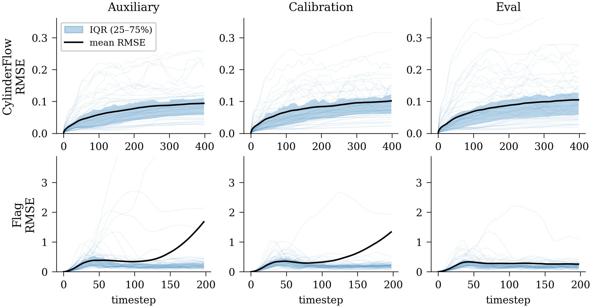
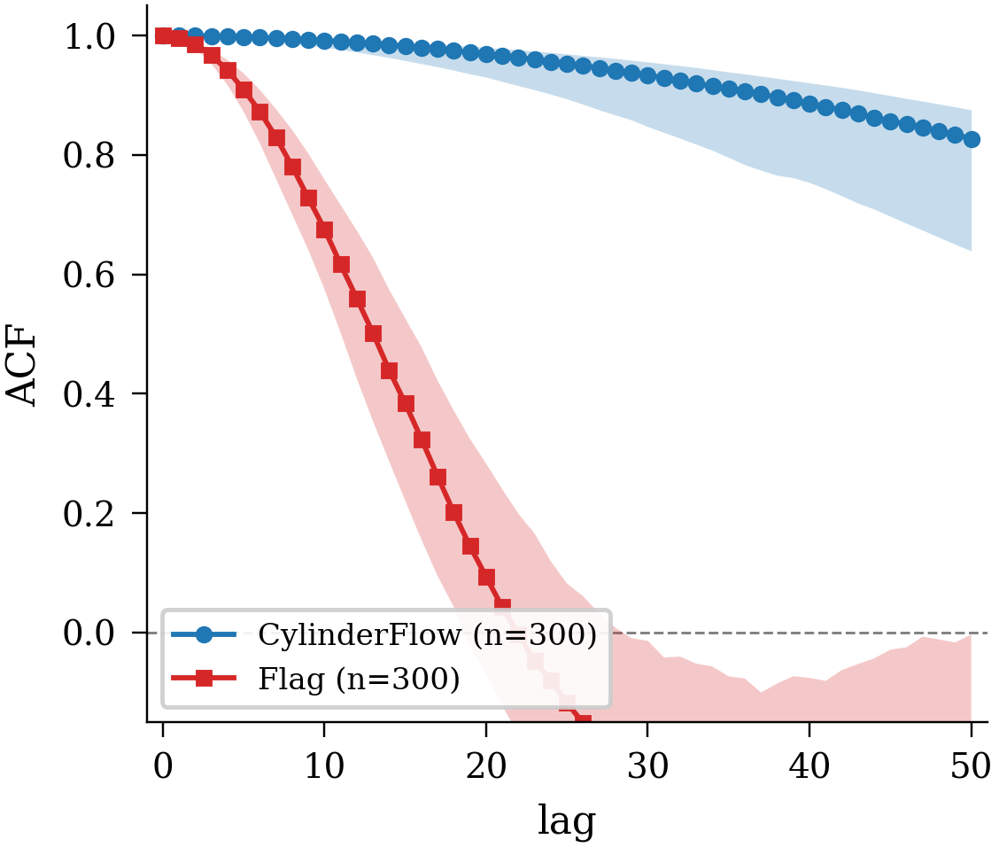
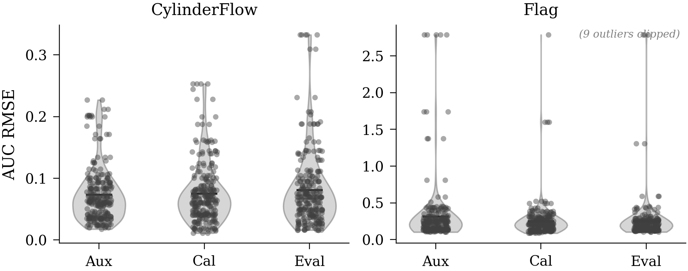
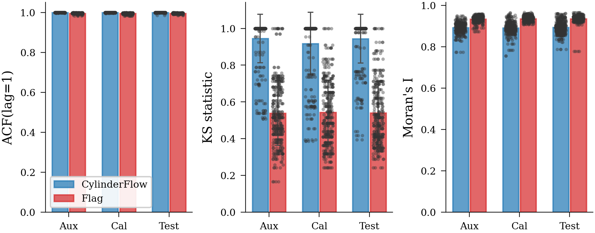

# Uncertainty Quantification Using Conformal Prediction for Mesh-Based Simulations

Code and artifacts for **post-hoc split conformal prediction** on **autoregressive surrogate rollouts** for mesh-based physics simulations.

## Key Findings

1. **Coverage is approximately valid** despite temporal/spatial dependence when calibration and evaluation share rollout dynamics.

2. **Efficiency depends on output structure**: Mahalanobis achieves smallest prediction sets for velocity fields (CylinderFlow), while CW-Adaptive is most efficient for position fields (Flag).

3. **CW-Adaptive** (component-wise adaptive scaling) provides tighter per-component bounds and best overall efficiency on Flag (72% width vs. L2 baseline at α=0.05).

4. **Temporal dependence** (ACF lag-1 ≈ 0.99) and **spatial dependence** (Moran's I ≈ 0.9) are pervasive.

5. **Scale**: Validated on ~75M samples (CylinderFlow) and ~31M samples (Flag).


## Overview

We study how split conformal prediction behaves when data come from **dependent, spatiotemporal rollouts** (not i.i.d.), and report empirical coverage and prediction set efficiency under controlled leakage prevention.

### Datasets

| Dataset | Domain | Output | Mesh Nodes | Timesteps | Eval Samples |
|---------|--------|--------|------------|-----------|--------------|
| **CylinderFlow** | CFD (2D) | Velocity (m/s) | ~1,900 | 400 | 74.7M |
| **Flag** | Cloth (3D) | Position (m) | ~1,800 | 200 | 31.3M |


### Conformal Prediction Methods

| Method | Score Function | Prediction Set Shape |
|--------|----------------|---------------------|
| **L2 Isotropic** | $s = \|r\|_2$ | Sphere (constant radius) |
| **L∞ Box** | $s = \|r\|_\infty$ | Hypercube (constant half-width) |
| **Mahalanobis** | $s = \sqrt{r^\top \Sigma^{-1} r}$ | Ellipsoid (learned covariance) |
| **Adaptive Scaling** | $s = \|r\|_2 / \sigma(x)$ | Sphere (spatially-varying radius) |
| **CW-Adaptive** | $s_j = \|r_j\| / \sigma_j(x)$ | Box (per-component adaptive width) |


## Results

### Surrogate Model Diagnostics

#### Error Accumulation Over Time
Autoregressive rollouts accumulate error over time. Each panel shows mean RMSE (black) with IQR bands (blue) across 100 trajectories.



#### Temporal Dependence (ACF)
Strong positive autocorrelation in RMSE(t) indicates temporal dependence, violating the i.i.d. assumption of standard conformal prediction.

<table>
  <tr>
    <td></td>
    <td></td>
  </tr>
</table>

#### Exchangeability Diagnostics
Batch diagnostics over 2,100 trajectories:



- ACF(lag=1) ≈ 1.0: strong temporal dependence
- Moran's I > 0.8: strong spatial autocorrelation

### Adaptive Scaling Calibration

The adaptive method learns a local uncertainty estimator σ(x) from auxiliary data. Normalized residuals z = ||r||₂/σ(x) should be approximately stationary if σ(x) is well-calibrated.


### Coverage & Efficiency

<table>
  <tr>
    <td></td>
  </tr>
  <tr>
    <td></td>
  </tr>
</table>

### Prediction Set Radii

Effective radius normalized by L2 baseline:

<table>
  <tr>
    <td></td>
  </tr>
  <tr>
    <td></td>
  </tr>
</table>

- **L2 Isotropic**: Constant radius
- **Mahalanobis**: Constant effective radius (accounts for correlation) — best for CylinderFlow
- **Adaptive**: Spatially-varying radius
- **CW-Adaptive**: Per-component adaptive width — best for Flag


## Quick Start

### Run Conformal Prediction

```bash
# CylinderFlow
python conformal/run_conformal.py \
  --aux_pkl meshgraphnet/rollouts_200k_big/rollout_cylinder_auxiliary_200k.pkl \
  --cal_pkl meshgraphnet/rollouts_200k_big/rollout_cylinder_calibration_200k.pkl \
  --eval_pkl meshgraphnet/rollouts_200k_big/rollout_cylinder_test_200k.pkl \
  --outdir conformal/_out_cylinder \
  --alphas 0.1 0.05

# Flag
python conformal/run_conformal.py \
  --aux_pkl meshgraphnet/rollouts_200k_big/rollout_flag_auxiliary_200k.pkl \
  --cal_pkl meshgraphnet/rollouts_200k_big/rollout_flag_calibration_200k.pkl \
  --eval_pkl meshgraphnet/rollouts_200k_big/rollout_flag_test_200k.pkl \
  --outdir conformal/_out_flag \
  --sigma_model xgboost --sigma_cap_quantile 0.98 \
  --alphas 0.1 0.05
```

### Generate Figures

```bash
PYTHONPATH=. python plot/diagnostics.py error_accumulation --rollout_pkls meshgraphnet/rollouts_200k_big/*.pkl --layout 2x3
PYTHONPATH=. python plot/diagnostics.py acf_comparative --cylinder_pkls meshgraphnet/rollouts_200k_big/rollout_cylinder_*.pkl --flag_pkls meshgraphnet/rollouts_200k_big/rollout_flag_*.pkl
PYTHONPATH=. python plot/coverage.py --csv paper/tables_generated/cylinder_table.csv --dataset Cylinder
PYTHONPATH=. python plot/grid.py --mode radii --rollout_pkl meshgraphnet/rollouts_200k_big/rollout_cylinder_auxiliary_200k.pkl --conformal_out conformal/_out_cylinder
```

## Citation

```bibtex
@article{mabtoul2025conformal,
  title={Uncertainty Quantification Using Conformal Prediction for Mesh-Based Simulations},
  author={Mabtoul, Samira and Ali, Izhar and Ho, Shen-Shyang},
  journal={Philosophical Transactions of the Royal Society A},
  year={2025}
}
```