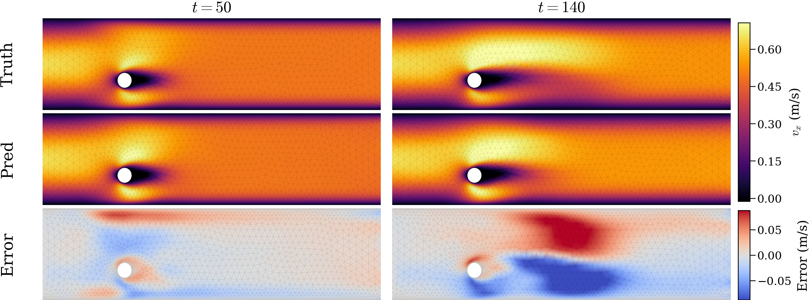

# Uncertainty Quantification Using Conformal Prediction for Mesh-Based Simulations

[](LICENSE)
[](https://doi.org/10.5281/zenodo.20707220)

Code and artifacts for **post-hoc split conformal prediction** on **autoregressive surrogate (MeshGraphNet) rollouts** for mesh-based physics simulations.

## Motivation

Mesh-based neural surrogates roll out autoregressively, so their errors are **strongly dependent in time and space** — exactly the i.i.d./exchangeability assumption that split conformal prediction relies on for finite-sample coverage. This repository asks a practical question: **does split conformal prediction still give useful, near-nominal prediction sets when the data come from dependent spatiotemporal rollouts**, and **which score function yields the tightest sets** for different output structures (velocity vs. position)?



## Key Findings

1. **Coverage is approximately valid** despite temporal/spatial dependence when calibration and evaluation share rollout dynamics.
2. **Efficiency depends on output structure**: Mahalanobis gives the smallest sets for velocity fields (CylinderFlow); CW-Adaptive is most efficient for position fields (Flag, 72% of L2-baseline width at α=0.05).
3. **Dependence is pervasive**: temporal ACF(lag-1) ≈ 0.99, spatial Moran's I ≈ 0.9.
4. **Scale**: validated on ~75M samples (CylinderFlow) and ~31M samples (Flag).

| Dataset | Domain | Output | Mesh Nodes | Timesteps | Eval Samples | Best method |
|---------|--------|--------|-----------:|----------:|-------------:|-------------|
| **CylinderFlow** | CFD (2D) | Velocity (m/s) | ~1,900 | 400 | 74.7M | Mahalanobis |
| **Flag** | Cloth (3D) | Position (m) | ~1,800 | 200 | 31.3M | CW-Adaptive |

## Repository Map

| Path | Contents |
|------|----------|
| [`meshgraphnet/`](meshgraphnet/README.md) | Train the TF1 MeshGraphNet surrogate, build trajectory-disjoint splits, generate rollouts. Diagnostics & sensitivity results in [`meshgraphnet/RESULTS.md`](meshgraphnet/RESULTS.md). |
| [`conformal/`](conformal/README.md) | Split conformal prediction over rollouts — L2, L∞, Mahalanobis, adaptive, CW-adaptive score functions. Coverage & efficiency results in [`conformal/RESULTS.md`](conformal/RESULTS.md). |
| [`plot/`](plot/) | Figure generation for diagnostics, coverage, radii, and meshes. |
| [`checkpoints/`](checkpoints/README.md) | Trained TF1 checkpoints (step 200k) for both datasets. |
| [`assets/`](assets/) | Generated figures. |

## Quick Start

The conformal stage runs on plain Python (`pip install -r requirements.txt`); training/rollout generation needs the DeepMind TF1 container (see [`meshgraphnet/README.md`](meshgraphnet/README.md)).

```bash
# Run conformal prediction on existing rollouts (CylinderFlow shown)
python conformal/run_conformal.py \
  --aux_pkl  <auxiliary>.pkl \
  --cal_pkl  <calibration>.pkl \
  --eval_pkl <test>.pkl \
  --outdir   conformal/_out_cylinder \
  --alphas 0.1 0.05
```

Full CLI options, the Flag recipe, and figure-generation commands are documented in [`conformal/README.md`](conformal/README.md) and [`plot/`](plot/).

## Data Availability

This repository includes everything needed to **regenerate** the results:

- **Trained surrogate checkpoints** (`checkpoints/`): TF1 MeshGraphNet checkpoints at step 200,000 for both datasets — see [`checkpoints/README.md`](checkpoints/README.md).
- **Source datasets**: the CylinderFlow and Flag datasets are released by DeepMind; download and prepare them with [`meshgraphnet/download_and_prepare_data.sh`](meshgraphnet/download_and_prepare_data.sh).

The large rollout artifacts (`meshgraphnet/rollouts_200k_big/*.pkl`) used by the commands above are **not committed** due to size; regenerate them from the included checkpoints (see [`meshgraphnet/README.md`](meshgraphnet/README.md)).

## Citation

If you use this software, please cite both the article and the archived software release.

```bibtex
@article{mabtoul2026conformal,
  title={Uncertainty Quantification Using Conformal Prediction for Mesh-Based Simulations},
  author={Mabtoul, Samira and Ali, Izhar and Ho, Shen-Shyang},
  journal={Philosophical Transactions of the Royal Society A},
  year={2026}
}
```

The archived software (Zenodo) can be cited via the DOI on the release badge above; machine-readable metadata is in [`CITATION.cff`](CITATION.cff).

## License

Released under the [MIT License](LICENSE).
