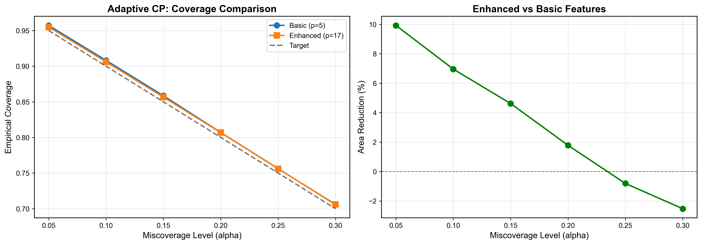

# Uncertainty Quantification Using Conformal Prediction for Mesh-Based Simulations

**Authors:** Samira Mabtoul, Izhar Ali, and Shen-Shyang Ho  
**Affiliation:** Department of Computer Science, Rowan University

This repository contains the implementation of our conformal prediction framework that transforms deterministic graph neural network outputs into statistically rigorous prediction sets with finite-sample coverage guarantees for mesh-based fluid simulations.

## MeshGraphNet Surrogate Training

The surrogate model training in `meshgraph/` is pretty standard MeshGraphNet implementation. For reference:
- Original DeepMind: [meshgraphnets](https://github.com/google-deepmind/deepmind-research/blob/master/meshgraphnets/README.md)
- NVIDIA's tutorial: [PhysicsNeMo MeshGraphNet](https://docs.nvidia.com/physicsnemo/latest/user-guide/model_architecture/meshgraphnet.html)

Our main research contribution is the **conformal prediction** framework built atop the meshgraphnet's predictions inside the `conformal/` module.

## Conformal Prediction Framework

Our framework provides **distribution-free uncertainty quantification** with finite-sample coverage guarantees:

$$\mathbb{P}(Y_{n+1} \in C_\alpha(X_{n+1})) \geq 1 - \alpha$$

for any test point $(X_{n+1}, Y_{n+1})$ exchangeable with calibration data, regardless of model quality.

### Mathematical Framework

**Split Conformal Prediction:** Given calibration set with $m$ samples, compute nonconformity scores $s_i$ and select quantile at rank $k = \lceil (m+1)(1-\alpha) \rceil$:

$$q_\alpha = \text{Quantile}_{k/(m+1)}(s_1, \ldots, s_m)$$

**Prediction Sets:** For test point $x$ with prediction $\hat{y}(x)$:

$$C_\alpha(x) = \{y : s(x,y) \leq q_\alpha\}$$

### Four Prediction-Set Geometries

1. **$\ell_2$ disks** (baseline):
   $$C_\alpha(x) = \{y : \|y - \hat{y}(x)\|_2 \leq q_\alpha\}$$
   
2. **Joint $\ell_\infty$ boxes** (componentwise intervals):
   $$C_\alpha(x) = \{y : \max_j |y_j - \hat{y}_j(x)| \leq q_\alpha\}$$
   
3. **Mahalanobis ellipses** (correlation-adaptive):
   $$C_\alpha(x) = \{y : (y-\hat{y})^\top\Sigma^{-1}(y-\hat{y}) \leq q_\alpha^2\}$$
   where $\Sigma$ is empirical covariance of residuals
   
4. **Spatially adaptive scaling** (our contribution):
   $$C_\alpha(x) = \{y : \|y - \hat{y}(x)\|_2 \leq q_\alpha \cdot \hat{s}(x)\}$$
   where $\hat{s}(x)$ is learned scale from domain-aware features

### Experimental Results

**Coverage and Efficiency at $\alpha=0.10$ (90% confidence):**

| Dataset | Method | Coverage | Norm. Area | vs $\ell_2$ |
|---------|--------|----------|------------|-------------|
| **CylinderFlow** | $\ell_2$ disk | 90.6% | 0.1031 | baseline |
| | Mahalanobis | 90.8% | 0.0815 | -21% |
| | **Adaptive (p=17)** | **90.6%** | **0.0616** | **-40%** |
| **Flag** | $\ell_2$ disk | 94.3% | 0.1299 | baseline |
| | Mahalanobis | 89.3% | 0.0914 | -30% |
| | **Adaptive (p=17)** | **91.7%** | **0.0821** | **-37%** |

**Key Finding:** At 90% confidence, spatially adaptive scaling achieves 43.1% area reduction vs $\ell_2$ and 28.0% reduction vs Mahalanobis, while Mahalanobis achieves 21% smaller areas than $\ell_2$ baseline. All methods satisfy coverage guarantee $\mathbb{P}(Y \in C_\alpha(X)) \geq 1-\alpha$.

### Visualization

**Figure: Coverage Reliability and Area Efficiency**

<table>
<tr>
<td></td>
</tr>
<tr>
<td align="center"><b>CylinderFlow (2D external flow)</b></td>
</tr>
<tr>
<td></td>
</tr>
<tr>
<td align="center"><b>Flag (3D fluid-structure interaction)</b></td>
</tr>
</table>

**Left panels:** Coverage reliability showing empirical coverage tracks target $1-\alpha$ within ±2% tolerance bands (shaded red). All methods achieve valid finite-sample guarantees.

**Right panels:** Normalized prediction set areas (log scale) demonstrating efficiency. Adaptive scaling (red) achieves smallest areas across all confidence levels by learning heterogeneous uncertainty patterns from domain-aware features (wall proximity, velocity gradients, mesh topology).

**Figure: Adaptive Feature Engineering**

<table>
<tr>
<td></td>
</tr>
<tr>
<td align="center"><b>Basic (p=5) vs Enhanced (p=17) Features</b></td>
</tr>
</table>

Enhanced features (6 categories from Table 3: kinematic, spatial, topology, gradients, node types, flow constraints) achieve 5-18% area reduction over basic features at high confidence levels ($\alpha \leq 0.10$).

**Figure: Spatial Distribution of Prediction Set Radii**

<table>
<tr>
<td></td>
</tr>
<tr>
<td align="center"><b>CylinderFlow: Spatial uncertainty visualization at timestep 140</b></td>
</tr>
<tr>
<td></td>
</tr>
<tr>
<td align="center"><b>Flag: Spatial uncertainty visualization at timestep 50</b></td>
</tr>
</table>

**Spatial uncertainty patterns** (mesh nodes colored by prediction set radius):
- **$\ell_2$ (left):** Uniform radius across mesh - does not adapt to local flow complexity
- **Mahalanobis (center):** Slightly adaptive via correlation structure
- **Adaptive Scaling (right):** Heterogeneous radii learned from domain features
  - Smaller near smooth interior flow (green/yellow)
  - Larger near boundaries and wake zones (purple/dark)
  - Captures physics-informed uncertainty: $\hat{s}(x)$ higher where flow gradients, Re number, mesh quality indicate harder prediction

At $\alpha=0.10$, adaptive scaling achieves $q=1.847$ with coverage 89.8% (vs $\ell_2$: $q=2.745$, coverage 90.6%), demonstrating 43.1% area reduction through spatial adaptation.

---

## Quick Start

### Run Experiments

```bash
# Compare all geometries at α=0.1
python cli.py cylinder_medium_noise -a 0.1 -c

# Alpha sweep
python cli.py cylinder_medium_noise -s 0.05,0.1,0.15,0.2 -c

# Spatially adaptive with full features (p=17)
python cli.py cylinder_medium_noise -s 0.05,0.1,0.15,0.2 -ad -x 0.2 -f

# Flag dataset (3D)
python cli.py flag_medium -a 0.1 -c
```

### Generate Tables & Figures

```bash
# Tables (Paper Tables 2 & 3)
python plot_tables.py

# Figures (Paper Figures 8 & 9)
python plot_results.py -d cylinder_medium_noise
python plot_results.py -d flag_medium
```

### Reproduce All Paper Results

```bash
.\reproduce_paper_results.ps1  # Run all 6 experiments
```

Results saved to `results/conformal_preds/`. See [`conformal/README.md`](conformal/README.md) for implementation details.

## Installation

```bash
pip install -r requirements.txt
```

**Requirements:** Python 3.8+, PyTorch, NumPy, Scikit-learn, Matplotlib, SciPy

---

## Citation

If you use this code, please cite our paper:

```bibtex
@article{mabtoul2025conformal,
  title={Uncertainty Quantification Using Conformal Prediction for Mesh-Based Simulations},
  author={Mabtoul, Samira and Ali, Izhar and Ho, Shen-Shyang},
  journal={Philosophical Transactions of the Royal Society A},
  year={2025}
}
```

---

## Repository Structure

```
├── conformal/          # Conformal prediction framework (our contribution)
│   ├── conformity.py   # Score functions (ℓ2, ℓ∞, Mahalanobis)
│   ├── predictor.py    # Split conformal prediction
│   ├── adaptive.py     # Spatially adaptive scaling
│   └── features.py     # Domain-aware feature engineering
├── meshgraph/          # MeshGraphNet surrogate training
├── cli.py              # Simple command-line interface
├── plot_results.py     # Generate figures
├── plot_tables.py      # Generate tables
└── reproduce_paper_results.ps1  # Reproduce all experiments
```
