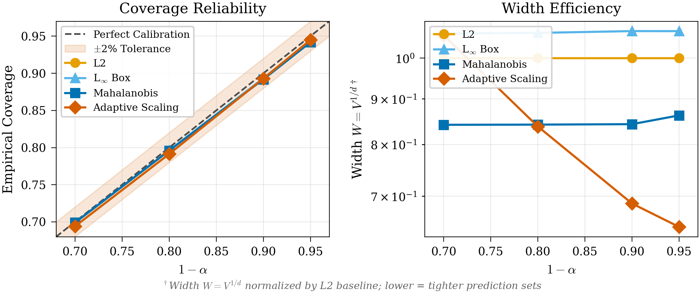
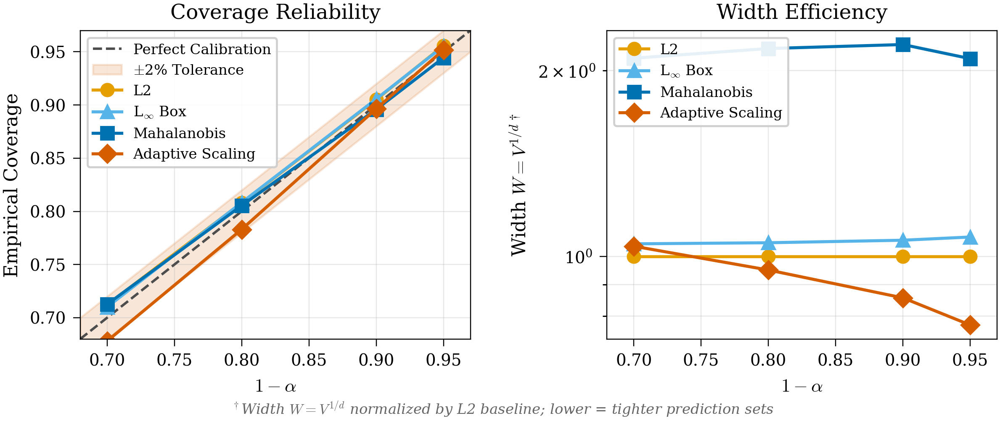
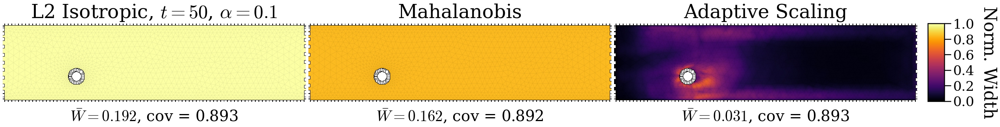
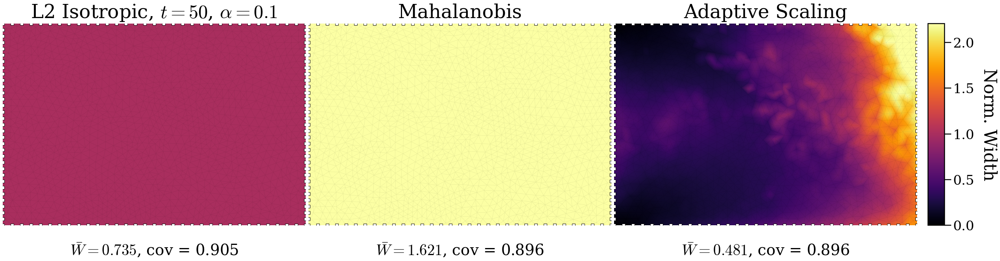
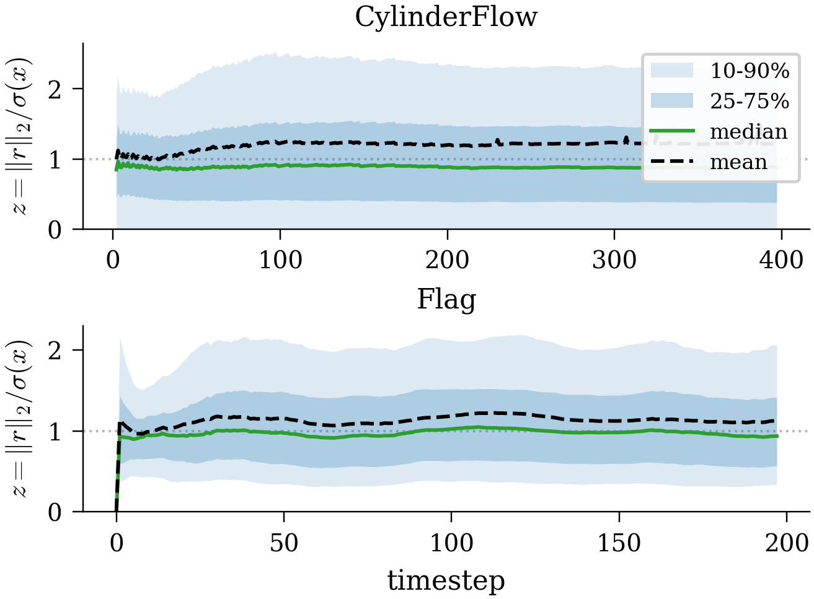

# Conformal Prediction Results

Empirical split conformal prediction on MeshGraphNet rollout `.pkl` files.

- Empirical coverages on spatiotemporal rollout data (not i.i.d.)
- Conformal quantile: $k=\lceil(n+1)(1-\alpha)\rceil$

## Configurations

| Dataset | Output Directory | Sigma Model | Sigma Cap |
|---------|-----------------|-------------|-----------|
| **Cylinder** | `_out_cylinder_200k_big_inregime_xgbq_physfull` | XGBoost | None |
| **Flag** | `_out_flag_200k_big_inregime_xgboost_sigcap098` | XGBoost | 0.98 |

## Coverage & Efficiency

<table>
  <tr>
    <td></td>
    <td></td>
  </tr>
</table>

- Left panels: Coverage reliability (empirical vs. target 1-α)
- Right panels: Normalized prediction set size (log scale)

## Prediction Set Radii





## σ(x) Calibration



Normalized residuals z = ||r||₂/σ(x). Median near 1.0 indicates calibration.

## Reproduce

```bash
cd <repo_root>
source .venv/bin/activate

# Cylinder
python3 conformal/run_conformal.py \
  --aux_pkl  meshgraphnet/rollouts_200k_big/rollout_cylinder_auxiliary_200k.pkl \
  --cal_pkl  meshgraphnet/rollouts_200k_big/rollout_cylinder_calibration_200k.pkl \
  --eval_pkl meshgraphnet/rollouts_200k_big/rollout_cylinder_test_200k.pkl \
  --outdir conformal/_out_cylinder_200k_big_inregime_xgbq_physfull \
  --alphas 0.3 0.2 0.1 0.05 \
  --sigma_model xgboost \
  --feature_set physics_full \
  --max_aux_cov 8000000 --max_aux_sigma 2000000 --max_cal 8000000 --max_eval 8000000 \
  --seed 42

# Flag
python3 conformal/run_conformal.py \
  --aux_pkl  meshgraphnet/rollouts_200k_big/rollout_flag_auxiliary_200k.pkl \
  --cal_pkl  meshgraphnet/rollouts_200k_big/rollout_flag_calibration_200k.pkl \
  --eval_pkl meshgraphnet/rollouts_200k_big/rollout_flag_test_200k.pkl \
  --outdir conformal/_out_flag_200k_big_inregime_xgboost_sigcap098 \
  --alphas 0.3 0.2 0.1 0.05 \
  --sigma_model xgboost \
  --feature_set physics_full \
  --sigma_cap_quantile 0.98 \
  --max_aux_cov 6000000 --max_aux_sigma 2000000 --max_cal 6000000 --max_eval 6000000 \
  --seed 42
```
