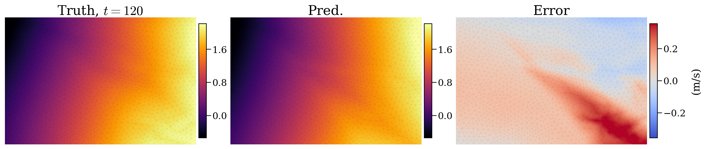
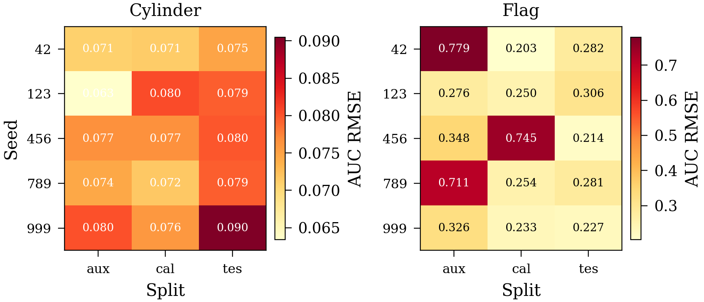
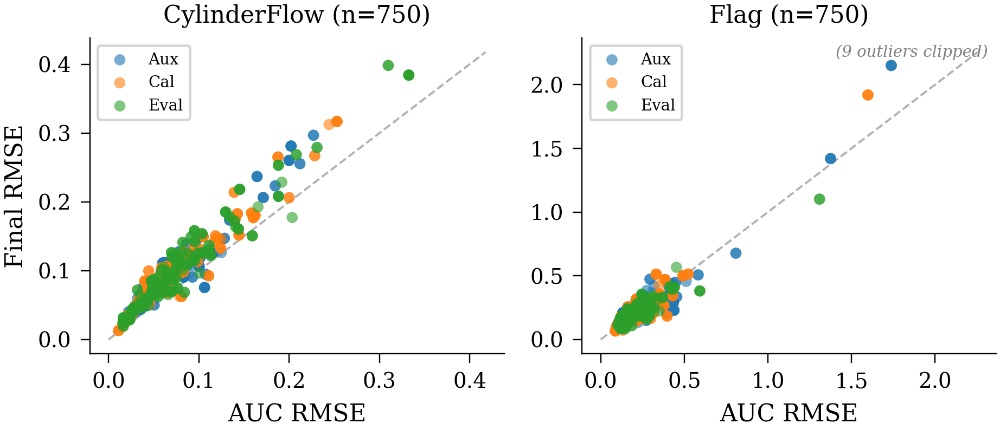
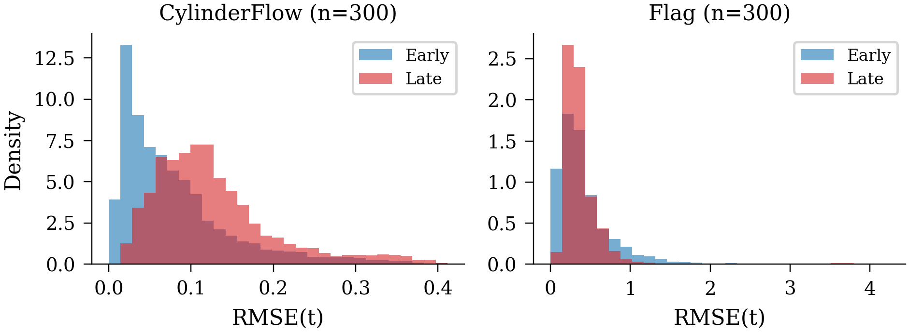
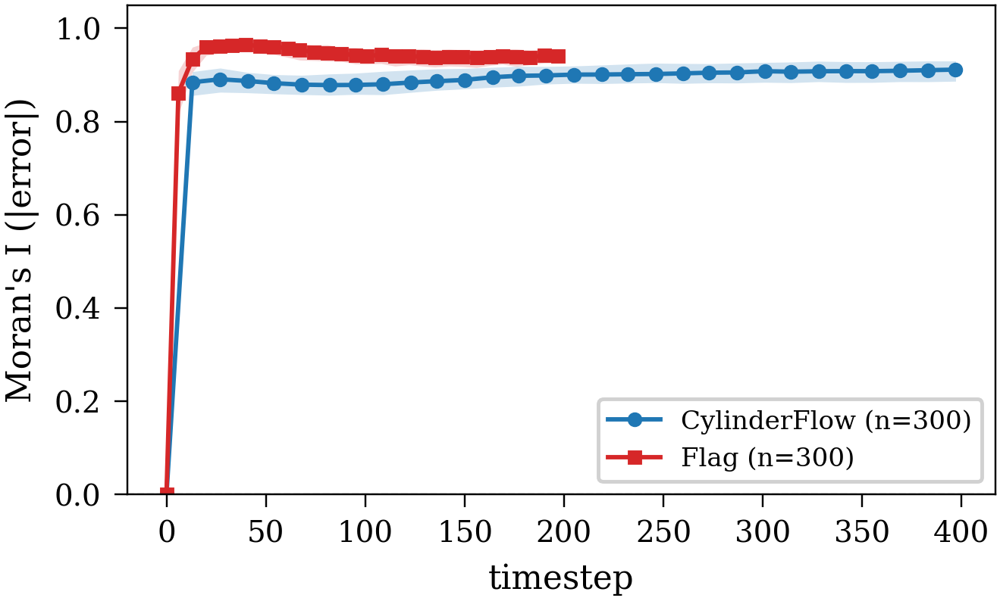

# MeshGraphNet Rollout Results

### Error Accumulation
RMSE(t) with IQR bands for CylinderFlow and Flag across splits.


### Exchangeability Diagnostics

<table>
  <tr>
    <td></td>
    <td></td>
  </tr>
</table>

### Batch Dependence


ACF(lag=1) ≈ 1.0: strong temporal dependence. Moran's I > 0.8: strong spatial autocorrelation.

---

## Dataset Snapshots

**CylinderFlow** (velocity, m/s):


**Flag** (position, m):



---

## CylinderFlow

### Split Sensitivity






| split | timesteps | n_points | AUC mean | AUC median | AUC IQR | AUC max | final max |
|---|---:|---:|---:|---:|---:|---:|---:|
| auxiliary | 118 | 25 | 0.0196981 | 0.00846178 | 0.0278136 | 0.10431 | 0.118591 |
| calibration | 48 | 15 | 0.0052356 | 0.00111894 | 0.0066987 | 0.0371509 | 0.046168 |
| test | 28 | 15 | 0.0299172 | 0.00145562 | 0.0559816 | 0.121191 | 0.142984 |

Seed-to-seed CV:

| split | seed AUC CV | seed final CV |
|---|---:|---:|
| auxiliary | 0.606615 | 0.587187 |
| calibration | 1.01096 | 0.925405 |
| test | 0.871903 | 0.8199 |

### Exchangeability Diagnostics

**Early vs Late RMSE:**



**Moran's I Over Time:**



| metric | value |
|---|---:|
| KS (early vs late) | 1.0 |
| ACF lag1 | 0.9987846 |
| ACF lag10 | 0.9352067 |
| Moran's I t50 | 0.8846683 |

### Batch Summary

| dataset | split | n | median ACF lag1 | median KS | median Moran's I |
|---|---|---:|---:|---:|---:|
| cylinder | auxiliary | 30 | 0.996551 | 0.448717 | 0.911792 |
| cylinder | calibration | 18 | 0.997197 | 1.000000 | 0.905795 |
| cylinder | test | 18 | 0.991893 | 1.000000 | 0.920948 |
| flag | auxiliary | 18 | 0.998029 | 1.000000 | 0.852299 |
| flag | calibration | 6 | 0.992179 | 1.000000 | 0.803843 |
| flag | test | 6 | 0.889908 | 1.000000 | 0.722940 |

---

## Flag

### Split Sensitivity

See CylinderFlow section (figures include both datasets).

| split | timesteps | n_points | AUC mean | AUC median | AUC IQR | AUC max | final max |
|---|---:|---:|---:|---:|---:|---:|---:|
| auxiliary | 58 | 15 | 0.497216 | 0.541313 | 0.172533 | 0.690459 | 1.35084 |
| calibration | 28 | 5 | 0.200757 | 0.172224 | 0.041714 | 0.273817 | 0.568633 |
| test | 8 | 5 | 0.0511362 | 0.052108 | 0.0163556 | 0.0684335 | 0.14974 |

| metric | value |
|---|---:|
| ACF lag1 | 0.9982037 |
| ACF lag10 | 0.7784182 |
| Moran's I t50 | 0.9515621 |

---

## Reproduce

```bash
cd <repo_root>
source .venv/bin/activate

# Split sensitivity
python -m meshgraphnet.utils.split_sensitivity \
  --rollouts_dir meshgraphnet/rollouts_sensitivity_big \
  --traj_idx -1 \
  --out_dir meshgraphnet/_artifacts/split_sensitivity_dense

# Error accumulation
python -m meshgraphnet.utils.error_accumulation \
  --rollout_pkl meshgraphnet/rollouts_200k_big/rollout_cylinder_auxiliary_200k.pkl \
  --rollout_pkl meshgraphnet/rollouts_200k_big/rollout_cylinder_calibration_200k.pkl \
  --rollout_pkl meshgraphnet/rollouts_200k_big/rollout_cylinder_test_200k.pkl \
  --traj_idx -1 \
  --out_dir meshgraphnet/_artifacts/error_accumulation/cylinder_rich

# Exchangeability (single)
python -m meshgraphnet.utils.exchangeability \
  --rollout_pkl meshgraphnet/rollouts_200k_big/rollout_cylinder_auxiliary_200k.pkl \
  --traj_idx 0 \
  --out_dir meshgraphnet/_artifacts/exchangeability/cylinder_aux_rich

# Exchangeability (batch)
python -m meshgraphnet.utils.exchangeability_batch \
  --out_dir meshgraphnet/_artifacts/exchangeability/batch_all \
  --rollouts_dirs meshgraphnet/rollouts_200k_big meshgraphnet/rollouts_sensitivity_big
```
